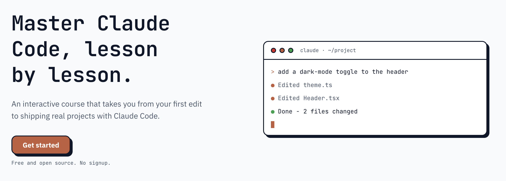

<div align="center">

<picture>
  <source media="(prefers-color-scheme: dark)" srcset="docs/assets/logo-dark.svg">
  
</picture>

### Learn Claude Code by doing.

A free, community-built platform that teaches [Claude Code](https://docs.claude.com/en/docs/claude-code) through hands-on lessons across three pathways: Beginner, Intermediate, and Advanced.

[](https://ccdojo.shucoll.com)
[](https://github.com/shucoll/claude-code-dojo/actions/workflows/ci.yml)
[](LICENSE)

**[Try it live →](https://ccdojo.shucoll.com)**  ·  [Contribute](#contribute)  ·  [Report an issue](https://github.com/shucoll/claude-code-dojo/issues)

</div>

---

## What it is

Claude Code Dojo is a guided, browser-based course that takes you from your first session to advanced Claude Code workflows. Pick a level and a language, work through a hierarchy of lessons, and your progress persists across sessions. It is free, open source, and built by the community.

No signups required. Open the platform and start.

<div align="center">
  <picture>
    <source media="(prefers-color-scheme: dark)" srcset="docs/assets/platform_screenshot_dark.png">
    
  </picture>
</div>

## What you'll learn

- **Beginner** — what Claude Code is, sessions and context, teaching Claude your project with CLAUDE.md, and a full guided project (Shelf).
- **Intermediate** — tools and permissions, context engineering, skills, hooks, MCP servers, subagents, plugins, and a guided project (PulseBoard).
- **Advanced** — deeper workflows and orchestration (in progress).

Lessons are mostly language-agnostic. Language selection applies only to the guided projects, so you build them in a stack you already know.

## Contribute

This is a community project, and fixes and improvements are welcome. If you spot a problem or want to propose a change or addition, please [open an issue](https://github.com/shucoll/claude-code-dojo/issues) first so it can be discussed. If you then decide to work on it, link your PR to that issue.

Before opening a PR, run `npm run check-snippets` (also enforced in CI).

## Run it locally

Requires Node 22 (see `.nvmrc`).

```bash
npm install
npm run dev
```

Common scripts:

| Command | Does |
|---|---|
| `npm run dev` | Start the dev server |
| `npm run build` | Type-check and bundle for production |
| `npm test` | Run the Vitest suite once |
| `npm run lint` | Run oxlint |
| `npm run check-snippets` | Content check (frontmatter + snippet/prompt coverage) |

## Tech stack

Vite, React 19, TypeScript (strict), Tailwind CSS v4 (CSS-first config, no `tailwind.config.js`), Framer Motion, MDX, and React Router. State lives in React Context and `localStorage` (namespaced `ccd:`). Tests run on Vitest with React Testing Library.

## Project structure

```
src/
  content/
    lessons/        MDX lessons, grouped by level
    snippets/       Per-language code/prompt packs (javascript.ts, python.ts, …)
    charts/         Chart definitions embedded in lessons
    structure.ts    Levels and modules (hand-edited)
    curriculum.ts   Generated from lesson frontmatter — never hand-edit
  components/       UI primitives and lesson components
  pages/            Route-level views
  lib/              Shared helpers
scripts/authoring/  Frontmatter-first authoring CLI (run via tsx)
docs/               Specs, plans, and the lesson style guide
design-system/      Design tokens and primitives (MASTER.md)
```

## Changelog

Notable feature and lesson updates are recorded in [CHANGELOG.md](CHANGELOG.md).

## License

[MIT](LICENSE)
